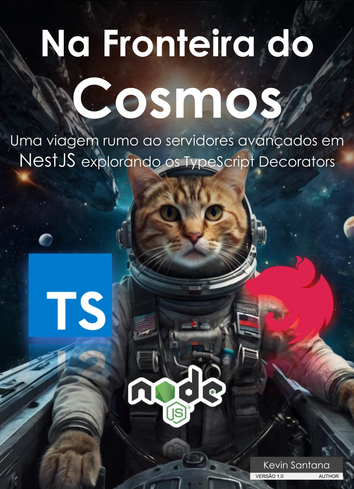

# Projeto EBOOK Gerado com auxilio de I.A.s

Projeto com o objetivo de gerar um ebook digital utilizando IA como ferramenta de apoio para produção rápida. todos os prompts
seguem abaixo.

### Versão Português BR
<a href="https://github.com/ZekDtonik/ebook-nestjs-decorators/blob/main/dist/Ebook%20-%20Na%20Fronteira%20do%20Cosmos.pdf" title="View PDF now"> 📕Clique aqui para ler</a>

### Version English US
<a href="https://github.com/ZekDtonik/ebook-nestjs-decorators/blob/main/dist/Ebook%20-%20On%20the%20edge%20of%20the%20Cosmos.pdf" title="View PDF now"> 📕Clique aqui para ler</a>

## 💻 Tecnologias utilizadas no projeto

- [ChatGPT](https://chat.openai.com/) 
- [Leonardo.ai](https://www.leonardo.ai)
- [Microsoft Copilot](https://copilot.microsoft.com)
- [Google Presentation](https://docs.google.com/presentation/u/0/)

> Nota sobre Midjourney：Na respectiva data em que foi realizada a tentativa de uso do midjourney um erro de negação de serviço foi emitido devido ao constante uso da comunidade para a versão free, logo, procurei alternativas para criar as imagens.
## 🧠 Prompts

ChatGPT：

|   Ação   | prompt                                                                                                                                                                                                                                                                         |
| :------: | --------------------------------------------------------------------------------------------
|  título  | Crie títulos de ebook sobre servidor em nodejs utilizando o framework NestJS, com um tema scifi, com um nicho de programação e subnicho de decorators no typescript                         |
| conteúdo | Defina em bullet points as caracteristas básicas dos decorators em javascripts com um tema scifi |
| conteúdo | crie para mim um texto em formato de topica para ebook sobre nestjs e suas capacidades com decorators       |
| conteúdo | definição de sintaxe e assinatura de um decorator em typescrpt |
| conteúdo | 

  > Importante! O contéudo exemplo foi criado manualmente com fragmentos de códigos obtidos a partir de uma sintaxe existente, não há prompts para o último capítulo

  > Nota: Todo o material foi revisado antes da publicação seguindo a documentação real de cada linguagem ou framework.

Leonardo.ai：

|  Ação  | prompt                                                                                 |
| :----: | -------------------------------------------------------------------------------------- |
| Título | space galaxy with a cat piloting inside a fighter ship |
| Background | space galaxy blue and dark with stars |
| Chapter Background | cosmos frontier and a cat inside a fighter ship navigating in space |

## ✨ Features

- Conteúdo gerado via ChatGPT
- Imagens geradas via Leonardo.ai e Microfoft Copilot
- Fragmento de código utilizado em plataforma real de um servidor em NestJS.

## 📚 Materiais

- Imagens utilizadas em `assets`
- ebook gerado durante as aulas em `dist`

## 🛠️ Instruções de execução

Utilize os prompts acima nas ferramentas sugeridas para gerar o material base e utilize uma ferramenta de edição de documentos como power point, libreoffice , indesign para diagramação.

## 👨‍💻 Expert

    
    <h3>&nbsp&nbsp&nbspKevin Santana </h3>
    
&nbsp&nbsp&nbsp
    <a href="https://github.com/zekdtonik">
    GitHub</a>&nbsp;|&nbsp;
    <a href="www.linkedin.com/in/kevin-fms">LinkedIn</a>
&nbsp;|&nbsp;
    <a href="https://www.instagram.com/keu_marxs/">
    Instagram</a>
&nbsp;&nbsp;

  

---

Criado por [Kevin Santana](https://github.com/zekdtonik) 💻💻
